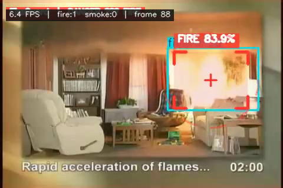
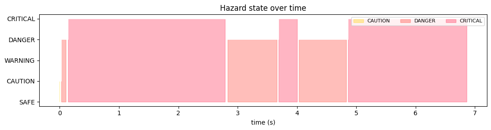

# 🔥 FireGuard

**Real-time fire & smoke detection on video — broadcast-grade overlays, hazard-state intelligence, and three generations of YOLO in one pipeline.**

[](https://colab.research.google.com/github/ParsaVictor/fireguard/blob/main/FireGuard.ipynb)
[](LICENSE)


> ⚠️ **Status: Demo release (v0.1)** — this is an early public preview for community review. The detection engine is fully working, but accuracy numbers are not yet benchmarked against standard fire datasets. Issue reports and PRs are very welcome!
>
> ⚠️ **وضعیت: نسخه دمو (v0.1)** — این یک پیش‌نمایش اولیه برای بازخورد جامعه است. موتور تشخیص کاملاً کار می‌کند، اما اعداد دقت هنوز روی دیتاست‌های استاندارد ارزیابی نشده‌اند. گزارش باگ و پیشنهاد بسیار خوش‌آمدید!
>
> 🇮🇷 [خلاصه فارسی](#-فارسی) در انتهای همین فایل.



*Fire region filled + bracketed, confidence chip, crosshair, and live HUD — the dashed safety zone wraps the detected seat of the fire.*

---

## Why FireGuard?

Anyone can call `model.predict()` on a video. FireGuard wraps three verified pretrained detectors in a **safety-oriented perception pipeline**:

| | Raw YOLO | FireGuard |
|---|---|---|
| Alarms | fire every frame → spam / flicker | **temporal confirmation + hysteresis** → stable `SAFE → CAUTION → WARNING → DANGER → CRITICAL` state machine |
| Region marking | plain rectangles | corner brackets, **translucent fire-region fill**, dashed safety zone, label chips, HUD, pulsing alert border |
| Evidence | none | `events.csv` incident log + **PNG snapshots on every escalation** |
| Speed knobs | — | per-class confidence, `frame_skip` box reuse, FP16 on GPU, model swap |
| Flexibility | one model | **yolov8n / yolo11s / yolo26s** — or any custom `.pt`, labels auto-normalised |

## ✨ Features

- 🎯 **Zero-training detection** — pretrained public checkpoints, downloaded once and cached
- 🚦 **Hazard state machine** — `SAFE / CAUTION / WARNING / DANGER / CRITICAL` with confirmation window and clear hysteresis (no one-frame false alarms, no flicker)
- 🟥 **Fire-region marking** — the burning area is filled, bracketed, measured, and wrapped in a dashed safety zone with crosshair
- 📢 **Smart alerting** — anti-spam cooldown, per-incident `events.csv`, evidence snapshots
- ⚡ **Light & fast** — 3M-param nano model runs ~6 FPS on a plain CPU; GPU gives real-time+
- 🧩 **Profiles** — `standard`, `fire-only` (ignore smoke: government / open-terrain), `early-smoke` (earliest possible warning)
- 🖼️ **Broadcast-style overlay** — HUD, label chips, FPS/state readout, pulsing border in DANGER/CRITICAL

## 🤖 Model zoo

All weights are public Hugging Face checkpoints, verified working with this pipeline:

| Key | Checkpoint | Params | CPU ms/frame* | Best for |
|---|---|---|---|---|
| `yolov8n` | `rabahdev/fire-smoke-yolov8n` | 3.0M | ~150 | edge / weak CPU |
| `yolo11s` | `leeyunjai/yolo11-firedetect` | 9.4M | ~280 | balanced |
| `yolo26s` | `SalahALHaismawi/yolov26-fire-detection` | 9.9M | ~395 | best stability & accuracy |

\* measured on one CPU core at `imgsz=640`; expect **10–30× faster with any GPU**. Switch with one line: `CONFIG["model"] = "yolo11s"` — or point it at **your own** fine-tuned `.pt`.

## 🚀 Quickstart

**Option A — Google Colab (recommended, free GPU):**

[](https://colab.research.google.com/github/ParsaVictor/fireguard/blob/main/FireGuard.ipynb)
`Runtime → Change runtime type → T4 GPU`, then Run all. Point `VIDEO_PATH` at a video in your Drive.

**Option B — local:**

```bash
git clone https://github.com/ParsaVictor/fireguard.git
cd fireguard
pip install -r requirements.txt
jupyter lab FireGuard.ipynb
```

The repo ships with a short demo clip (`fire_detection_result.mp4`) so the notebook runs out of the box.

## ⚙️ Configuration (one cell)

```python
CONFIG = {
    "model":   "yolo26s",   # yolov8n | yolo11s | yolo26s | path/to/custom.pt
    "profile": "standard",  # standard | fire-only | early-smoke
    "conf_fire":  None,     # None -> profile default (0.30)
    "conf_smoke": None,     # None -> profile default (0.25)
    "frame_skip": 1,        # 2 = ~2x faster, boxes reused between inferences
    ...
}
```

| Profile | Fire | Smoke | Use case |
|---|---|---|---|
| `standard` | ✅ 0.30 | ✅ 0.25 | general monitoring |
| `fire-only` | ✅ 0.30 | ❌ | government / wildfire — smoke too ambiguous |
| `early-smoke` | ✅ 0.35 | ✅ **0.15** | earliest warning, indoor/warehouse |

## 🧠 Pipeline

```
video ─▶ frame ─▶ YOLO detect ─▶ label normalise ─▶ per-class conf/size filter
                                    │
                     HazardEngine ──┘   (confirm window: 2 hits / 5 frames
                                        clear hysteresis: 8 misses)
                                    │
              state ∈ {SAFE, CAUTION, WARNING, DANGER, CRITICAL}
                                    │
        ┌───────────┬───────────────┼────────────────┬──────────────┐
     overlay      alerts        events.csv      snapshots      result.mp4
   (brackets,   (cooldown     (incident       (evidence      (H.264 via
    fill, zone,  anti-spam)     timeline)       PNGs)           ffmpeg)
    HUD, pulse)
```

## 📁 Repository structure

```
fireguard/
├── FireGuard.ipynb          # ← everything: pipeline, demo run, benchmark
├── fireguard_core.py        # same engine as an importable module
├── fire_detection_result.mp4# bundled demo clip
├── requirements.txt
├── LICENSE
└── docs/                    # demo frames used in this README
```

Outputs land in `outputs/`: `fireguard_result.mp4`, `events.csv`, `snapshots/*.png`, `benchmark.csv`.

## 📸 Output

- **Video** — annotated MP4 (H.264): fire region filled red + bracketed, dashed safety zone, `FIRE 96.4%` chips, HUD with live state & FPS, pulsing border under DANGER/CRITICAL
- **`events.csv`** — every state transition with frame, timestamp, counts
- **Snapshots** — PNG evidence frame captured at each escalation
- **Hazard timeline** — the whole incident at a glance:



## 🛣️ Roadmap

- [ ] Live RTSP / webcam multi-camera manager
- [ ] Object tracking IDs (count *distinct* fire seats)
- [ ] Burned-area & spread-rate estimation
- [ ] Telegram / webhook alert integration
- [ ] Gradio web demo
- [ ] ONNX / TensorRT export recipes for Jetson & RPi5

## 🤝 Contributing

Issues and PRs welcome — especially new **verified model checkpoints** for the zoo (open an issue with a benchmark on your data).

## 📄 License

[MIT](LICENSE) — free for commercial and personal use.

> ⚠️ FireGuard is an assistive tool. Always follow local fire-safety regulations; never deploy it as the sole life-safety system.

---

## 🇮🇷 فارسی

**FireGuard** یک سیستم هوشمند تشخیص آتش و دود روی ویدیو است:

- **بدون نیاز به آموزش** — سه مدل آماده و راستی‌آزمایی‌شده (YOLOv8n / YOLO11s / YOLO26s) که با یک خط کد عوض می‌شوند
- **مشخص‌سازی محدوده آتش** — ناحیه آتش با پرشدگی قرمز ملایم، براکت‌های گوشه، برچسب درصد اطمینان و **ناحیه ایمنی خط‌چین** مشخص می‌شود
- **ماشین وضعیت خطر** — از `SAFE` تا `CRITICAL` با تأیید چندفریمی و هیسترزیس؛ بدون هشدار کاذب و بدون فلیکر
- **هشدار و مستندسازی** — ضد اسپم، فایل `events.csv` از رویدادها و اسنپ‌شات تصویری هنگام تشدید خطر
- **پروفایل‌های آماده** — استاندارد، فقط-آتش (مناسب نهادها و فضای باز)، و دود-زودهنگام (حداکثر حساسیت)
- **سبک و سریع** — از اجرای ~۶ فریم بر ثانیه روی CPU معمولی تا Real-time+ روی GPU

اجرا در Colab با یک کلیک (دکمه بالا) یا به‌صورت محلی با `pip install -r requirements.txt`.
